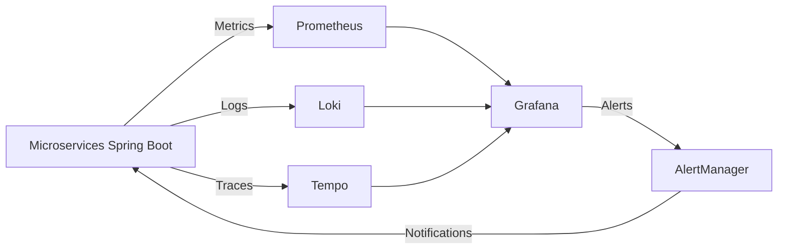

# 📊 Observability Stack Documentation

## 🧠 Vue d’ensemble

Ce projet utilise une stack d’observabilité complète pour surveiller les microservices :

* **Grafana** → visualisation des métriques, logs et traces
* **Prometheus** → collecte des métriques
* **Loki** → centralisation des logs
* **Tempo** → tracing distribué des requêtes

---

# 🏗️ Architecture globale



# 🚀 Démarrage des services

## 📦 Avec Docker Compose

```bash
docker compose up -d
```

Services exposés :

| Service    | URL                                            |
| ---------- | ---------------------------------------------- |
| Grafana    | [http://localhost:3001](http://localhost:3001) |
| Prometheus | [http://localhost:9090](http://localhost:9090) |
| Loki       | [http://localhost:3100](http://localhost:3100) |
| Tempo      | [http://localhost:3200](http://localhost:3200) |

---

# 📊 Grafana Setup

## 🔗 Accès

```text
http://localhost:3001
```

Login par défaut :

```text
admin / admin
```

---

## ➕ Ajouter les Data Sources

Dans Grafana :

### 1. Prometheus

```text
Name: Prometheus
URL: http://prometheus:9090
```

👉 Données :

* CPU
* RAM
* HTTP requests
* latence

---

### 2. Loki (Logs)

```text
Name: Loki
URL: http://loki:3100
```

👉 Données :

* logs applicatifs
* erreurs
* stack traces

---

### 3. Tempo (Traces)

```text
Name: Tempo
URL: http://tempo:3200
```

👉 Données :

* flow des requêtes
* propagation entre microservices

---

# 📡 Prometheus Configuration

## 📄 `prometheus.yml`

```yaml
global:
  scrape_interval: 5s

scrape_configs:
  - job_name: 'gateway'
    metrics_path: '/actuator/prometheus'
    static_configs:
      - targets: ['api-gateway:8080']

  - job_name: 'services'
    metrics_path: '/actuator/prometheus'
    static_configs:
      - targets:
          - identity-service:8081
          - ticket-service:8082
```

---

# 🧵 Tracing (Tempo + Spring Boot)

## 🔧 Spring Boot config

```yaml
management:
  tracing:
    sampling:
      probability: 0.1
```

👉 Cela permet :

* suivre une requête de bout en bout
* relier gateway → services → DB

---

# 🪵 Logs (Loki)

## 🔧 Format recommandé

```yaml
logging:
  pattern:
    level: "%5p [${spring.application.name},%X{traceId:-},%X{spanId:-}]"
```

👉 Permet :

* corrélation logs ↔ traces
* debug précis d’une requête

---

# 📈 Dashboards recommandés

## 🔥 Gateway Dashboard

* requests/sec
* latency (p95 / p99)
* error rate

---

## 🧠 Service Dashboard

* JVM memory
* GC time
* CPU usage
* HTTP requests

---

## 🧵 Trace View

* request flow
* service dependencies
* bottlenecks

---

## 🔐 Sécurité Grafana

⚠️ **Important** : Changez le mot de passe par défaut `admin / admin` dès la première connexion pour des raisons de sécurité.

Dans Grafana :
1. Allez dans **Administration** > **Users and access** > **Users**.
2. Cliquez sur l'utilisateur `admin`.
3. Modifiez le mot de passe dans l'onglet **Change password**.

---

# 🚨 Alerting (optionnel mais recommandé)

Grafana peut déclencher :

* 🔴 API down
* 🟠 latence élevée
* 🔥 error spike

Notifications :

* Slack
* Email
* Webhook (WhatsApp possible via API 👀)
